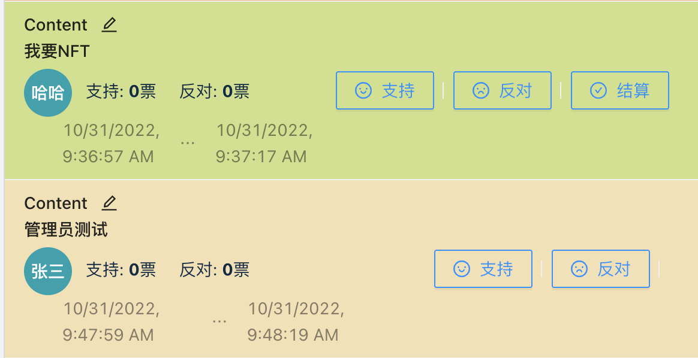

# DApp-StudentSocietyDAO
LAB for ZJU-blockchain-course-2022. A website for student society to make proposals and vote.

###### 赵伊蕾		学号：3200104866

#### 1⃣️Task

> 去中心化学生社团组织治理应用 
>
> - 每个学生初始可以拥有或领取一些通证积分（ERC20）。 
> - 每个学生可以在应用中可以： 
>   1. 使用一定数量通证积分，发起关于该社团进行活动或制定规则的提案（Proposal）。 
>   2. 提案发起后一定支出时间内，使用一定数量通证积分可以对提案进行投票（赞成或反对，限制投票次数），投票行为被记录到区块链上。 
>   3. 提案投票时间截止后，赞成数大于反对数的提案通过，提案发起者作为贡献者可以领取一定的积分奖励。 
>
> - (Bonus）发起提案并通过3次的学生，可以领取社团颁发的纪念品（ERC721）

#### 2⃣️Contracts

```bash
├── studentSocietyDAO
			├── MyERC20
			└── MyERC721        # 公开代码
```

studentSocietyDAO is a system which provide a transparent and open platform for students to propose and vote here. To maintain the rules of DAO, we need `ERC20` and `ERC721` to empower and reward the students.

#### 3⃣️Deployment

1. 在本地启动ganache应用，用ganache生成测试链地址的私钥替换config文件里的私钥。

2. 在 `./contracts` 中安装需要的依赖，运行如下的命令：

   ```bash
   npm install
   ```

3. 在 `./contracts` 中编译合约，运行如下的命令：

   ```bash
   npx hardhat compile
   ```

   这一步也可在`remix`上完成。

4. 向小狐狸中导入ganache本地测试链形成的账户地址(通过导入私钥)

​		同时也要在前端的`hardhat.config.ts`文件中粘贴几个账户的私钥，其中第一个私钥对应的账户将被当作管理员账户。


5. 在`./contract`下部署合约

```bash
# run test script
npx hardhat test
# run deploy script
npx hardhat run scripts/deploy.ts
# deploy on ganache
# you should start a ganache application before you run this command
npx hardhat run scripts/deploy.ts --network ganache
```

5. 把部署合约得到的三个合约地址写入`./frontend/src/utils/contract-address.json`文件中


6. 在 `./frontend` 中启动前端程序，运行如下的命令：

```bash
npm install
npm run start
```

#### 4⃣️Function Display

##### 1. 登陆连接账户 领取空投

​		登陆界面，如果部署成功，一登陆就会显示管理员账号，然后通过点击`连接钱包`按钮与小狐狸建立连接。


​		成功连接的界面如图所示，将会分别显示管理员地址、当前用户地址。并且，如果在小狐狸中切换账号然后刷新界面，web会动态更改当前用户的账号。


​			小狐狸与网页正常连接之后即可领取通证积分。下方是`ERC20`合约中编写的`airdrop`函数，用以空投通证积分，在此用`require`约束每人只能领取一次空投，而且空投的数目是`2000`通证积分。领取通证积分之后，用户即可发送提案、进行投票。

```solidity
function airdrop() external {
    require(claimedAirdropPlayerList[msg.sender] == false, "This user has claimed airdrop already");
    //_mint()是openzeppelin中ERC20的函数，用于分发ETH
    _mint(msg.sender, 2000);
    claimedAirdropPlayerList[msg.sender] = true;
}
```

##### 2.发送提案、投票的规则

- 提案内容长度限制在200字以内，用户可以根据自己的情况署名/匿名。每次投入的通证积分数最少为`300`，当然用户也可以多投一些，这样可以提高提案通过的概率。这可以理解成提出提案的`cost`是`300`通证积分，多余的积分用来自己为自己投票。投票发布的最短持续时间是`20`秒。通证积分个数、投票最短时长的限制都是通过`input`框的`min`变量来控制的。


- 用户发布提案之后，其他所有链上用户都会看到提案的内容，然后可以在指定时间内进行投票。投票将消耗`100`通证积分，反对、赞成票数都会实时地显示在提案中。只有在投票结束前，获得赞成票>=反对票的提案才会被通过。然后管理员会确认提案，为发出提案的同学奖励通证积分。奖励规则如下：该提案得到的所有赞成票对应的通证积分将全部转入提案同学的钱包地址。
- 如果用户发布的`3`个提案全都被通过，系统会自动为用户打造一枚专属的`NFT`。本系统由于比较简单，所以`NFT`仅用一个编号(`0-10000`)表示。用户的专属`NFT`标识也会显示在途中的`List`框内 。

Proposal提案的结构如下：

```solidity
struct Proposal {
    uint32 index;      // index of this proposal
    address proposer;  // who make this proposal
    uint256 startTime; // proposal start time
    uint256 duration;  // proposal duration
    string name;       // proposal name
    string proposerName;
    uint32 approvement;
    uint32 disapprovement;
    mapping(address => uint32) times; //proposal time
    bool publishment;  // proposal publish or not
}
```

##### 3. 进行提案、投票

​		如下图所示，提案的总个数、参与投票人数将动态显示在下方栏目中。用户可以在输入框中输入自己发送提案的内容，只要没有格式错误(例如没有设置投入的通证积分个数、时间等参数)，链接小狐狸发送提出提案请求的话 ，都是可以成功连接然后完成交易的。成功发布提案会有一个`alert`提示框。


​		在提案栏目中，使用了前端的List对所有提案进行展示。`ProposalList`中会显示提案内容、发起者姓名、提案发送和结束的时间等信息。为了方便用户辨识，未到投票截止时间的`proposal`将显示黄色背景；如果提案被通过，将显示绿色背景；如果提案不通过，将显示橙色背景 。右下图是提案栏目的三种状态。


​		用户通过点击`支持`或者`反对`按钮，对该投案进行投票。代码中使用到`proposal`结构体中的`times`变量，对用户投票的次数进行控制。以下是投票的合约代码:

```solidity
function vote(uint32 index, bool vote_, uint32 amount) public {
        
    if(amount < voteCost)
        revert("Unaffordable! Please get more token");
    if(index > pro_num || block.timestamp > proposals[index].duration + proposals[index].startTime)
        revert("Proposal not found. It may has ended!");
    studentERC20.transferFrom(msg.sender, address(this), amount);//花费100进行投票
    // 把参与者加入到投票人中
    student.push(msg.sender);
    Proposal storage prop_ = proposals[index];
    if(vote_){//approvement
        prop_.approvement += amount / voteCost;
    }else{
        prop_.disapprovement += amount / voteCost;
    }
    prop_.times[msg.sender] += amount / voteCost;
}
```

##### 4. 管理员确认通过提案, 为提案提出方发送通证积分奖励

​		根据规则，成功通过的提案，提出者将能获得提案得到支持票对应的所有通证积分。我们切换到管理员界面对提案进行确认。管理员界面会比普通用户多一个'结算'按钮，当然这个按钮只有投票结束的提案才会出现(如右下图)。



​		根据合约中的代码，我们将使用到`ERC20`的`transfer`函数，向提案的提出者转入一定数量通证积分奖励。支持票的通证积分将全部奖励给提案提出者，但是反对票的通证积分将被销毁(转入某个deadAddress)。

​		以下为管理员确认提案的合约函数。虽然函数没有设置`only manager`，但是在前端我们设置了只有管理员才能触发按钮，所以从逻辑上说是还是只有管理员能够“开奖”。

```solidity
function DecideProposal(uint32 index) public{
    require(block.timestamp >= proposals[index].startTime + proposals[index].duration);
    require(proposals[index].publishment == false);
    proposals[index].publishment = true;
    if(proposals[index].approvement >= proposals[index].disapprovement){
      // 对提议提出者转账所有的approvement通行证
      published_proposals_[proposals[index].proposer] += 1;
      studentERC20.transfer(proposals[index].proposer, proposals[index].approvement * voteCost);
      if(published_proposals_[proposals[index].proposer] == 3){
          // 随机分发一个tokenId, tokenId是0～10000的随机整数
          uint256 tokenid = rand_int256(10000);
          studentERC721.mint(proposals[index].proposer, tokenid);
          tokenId[proposals[index].proposer] = tokenid;
      }
    }  
}
```

##### 5. 奖励NFT

​		对于成功发布并通过3个提案的学生，系统将自动奖励一个特定编号的NFT(编号在0-10000内)。如果该地址账户获得NFT，则会在界面上显示如下。这个NFT栏目只会显示在该特定账户得到的NFT，不会显示其他用户的NFT。


​		以下为我拓展的`ERC721`合约分发`NFT`的函数。`_mint`是`ERC721`本身的函数，该合约会验证改地址是否分发过`NFT`，所以我们不需要额外建立`map`去判断。

```solidity
function mint(address to, uint256 tokenId) public onlyManager {
    // 这里不需要判断to这个地址是否被分发过NFT，因为ERC721合约里有详细的判断定义
    _mint(to, tokenId);
    NFTOwner[to] = tokenId;
    mapNFT[total_supply] = tokenId;
    total_supply++;
}
```

​		NFT的编号是随机生成的，由于ETH不允许合约中产生随机数，所以我们要利用该区块的一些信息还有特定的加密算法，来生成'伪'随机数。下方函数是可以生成`0-length`范围内`uint256`整数，这还用到了`keccak256`加密算法和 block的时间戳、难度等参数。

```solidity
function rand_int256(uint256 length) public view returns(uint256){
    uint256 hash = uint256(keccak256(abi.encodePacked(block.timestamp, block.difficulty)));
    return hash % length;
    }
```

#### 5⃣️References

1. [OpenZepplin - ERC20](https://github.com/OpenZeppelin/openzeppelin-contracts/blob/master/contracts/token/ERC20/ERC20.sol)
2. [OpenZepplin - ERC721](https://github.com/OpenZeppelin/openzeppelin-contracts/tree/master/contracts/token/ERC721)

3. [DApp-开发框架参考](https://github.com/LBruyne/ZJU-blockchain-course-2022)

4. [课程demo参考](https://github.com/LBruyne/blockchain-course-demos)

